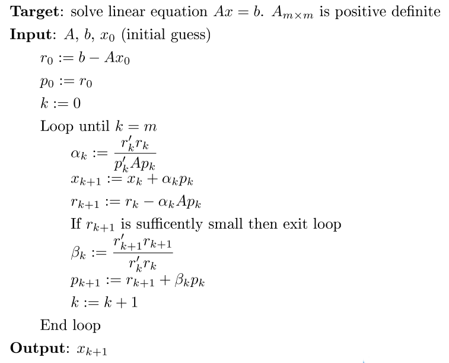

## 一
### 问题描述
求解线性方程组 Ax=b，其中 A 为 nxn 维的已知矩阵，b 为 n 维的已知向量，x 为 n 维的未知向量。A 与 b 中的元素服从独立同分布的正态分布。
### 算法设计
**1. 高斯消去法**  
首先，要将 L_1 以下的等式中的 x 消除，然后再将 L_k (k=1,2,...,n-1) 以下的等式中的 y 消除。这样可使整个方程组变成一个三角形似的格式。之后再将已得出的答案一个个地代入已被简化的等式中的未知数中，就可求出其余的答案了。
```matlab
function x = GaussianElimination(A,b)
    dim=size(A,1);
    % 消去
    for i=1:dim
        if A(i,i)==0
            error('主元素=0，消去法无法进行');
            return;
        end
        for j=i+1:dim            
            m=A(j,i)/A(i,i);
            % A(j,:)=A(j,:)-m*A(i,:);
            A(j,i+1:dim)=A(j,i+1:dim)-m*A(i,i+1:dim);
            b(j)=b(j)-m*b(i);
        end
    end
    
    % 回代
    x=zeros(dim,1);
    x(dim)=b(dim)/A(dim,dim);
    for i=dim-1:-1:1
        x(i)=(b(i)-A(i,i+1:dim)*x(i+1:dim))/A(i,i);
    end
end
```
**2. 列主元消去法**  
在进行第 k (k=1,2,...,n-1) 步消元时，从第 k 列的 a_{kk} 及其以下的各元素中选取绝对值最大的元素，然后通过行变换将它交换到主元素 a_{kk} 的位置上，再进行消元。
```matlab
function x = EliminationWithMaximalColumnPivoting(A,b)
    dim=size(A,1);
    
    % 消去
    for i=1:dim
        % 选最大
        mcp=find(abs(A(i:dim,i))==max(abs(A(i:dim,i))))+i-1;
        if A(mcp,i)==0
            error('主元素=0，消去法无法进行');
            return;
        end
        % 交换
        tem=A(mcp,:);
        A(mcp,:)=A(i,:);
        A(i,:)=tem;
        tem=b(mcp);
        b(mcp)=b(i);
        b(i)=tem;
        for j=i+1:dim
            m=A(j,i)/A(i,i);
            % A(j,:)=A(j,:)-m*A(i,:);
            A(j,i+1:dim)=A(j,i+1:dim)-m*A(i,i+1:dim);
            b(j)=b(j)-m*b(i);
        end
    end
    
    % 回代
    x=zeros(dim,1);
    x(dim)=b(dim)/A(dim,dim);
    for i=dim-1:-1:1
        x(i)=(b(i)-A(i,i+1:dim)*x(i+1:dim))/A(i,i);
    end
end
```
### 数值实验
令 n=10、50、100、200，测试计算时间并绘制曲线。
```matlab
main();

function main()
    computeTime=zeros(2,4);
    size=[10,50,100,200];
    % 每种计算100个
    times=100;
    for j=1:4
        for i=1:times
            [time1,time2]=produceSolveComputeTime(size(j));
            computeTime(1,j)=computeTime(1,j)+time1;
            computeTime(2,j)=computeTime(2,j)+time2;
        end
    end
    % 平均
    computeTime=computeTime/times;
    plot(size(:),computeTime(1,:),'-',size(:),computeTime(2,:),'-');
    xlim([0,210]);
    set(gca,'XTick',[10,50,100,200]);
    legend('高斯消去法','列主元消去法');
end

% 随机生成独立同分布的正态分布的随机A和b，解，返回时间
function [time1,time2] = produceSolveComputeTime(size)
    A=randn(size);
    x=randn(size,1);
    b=A*x;
    tic;
    GaussianElimination(A,b);
    time1=toc;
    tic;
    EliminationWithMaximalColumnPivoting(A,b);
    time2=toc;
end
```
  
列主元消去法时间略长，因为涉及主元的寻找和行变换。

## 二
### 问题描述
求解线性方程组 Ax=b，其中 A 为 nxn 维的已知矩阵，b 为 n 维的已知向量，x 为 n 维的未知向量。A 为对称正定矩阵，其特征值服从独立同分布的 [0,1] 间的均匀分布; b 中的元素服从独立同分布的正态分布。
### 算法设计
D L U 是什么？？？？？  
**1. Jacobi 迭代法**  
x=J*x_k+f，其中？？？？J=D^(-1)*(L+U)，f=D^(-1)*b 。
```matlab
function [x,times]=Jacobi(A,b)
    dim=size(A,1);
    x=zeros(dim,1);
    D=diag(diag(A));
    %J=D^(-1)*(L+U)
    J=D\(-tril(A,-1)-triu(A,1));
    %f=D^(-1)*b
    f=D\b;
    x_k=zeros(dim,1);
    times=0;
    while 1
        x=J*x_k+f;
        %精度，用无穷范数（向量的所有元素的绝对值中最大的）
         if norm(x-x_k,inf)<1e-5
            break;
        end
        x_k=x;
        %迭代次数限制
        times=times+1;
        if times==29000
            error('超出迭代次数限制');
        end
    end
end
```
**2. Gauss-Seidel 迭代法**  
x=G*x_k+f，其中？？？？G=(D-L)^(-1)*U，f=D^(-1)*b 。
```matlab
function [x,times]=GaussSeidel(A,b)
    dim=size(A,1);
    x=zeros(dim,1);
    D=diag(diag(A));
    %G=(D-L)^(-1)*U
    G=(D+tril(A,-1))\(-triu(A,1));
    %f=D^(-1)*b
    f=(D+tril(A,-1))\b;
    x_k=zeros(dim,1);
    times=0;
    while 1
        x=G*x_k+f;
        %精度，用无穷范数（向量的所有元素的绝对值中最大的）
         if norm(x-x_k,inf)<1e-5
            break;
        end
        x_k=x;
        %迭代次数限制
        times=times+1;
        if times==29000
            error('超出迭代次数限制');
        end
    end
end
```
**3. 逐次超松弛迭代法**  
x=Lw*x_k+f，其中？？？？Lw=(D-w*L)\((1-w)*D+w*U)，f=w(D-wL)^(-1)b 。
```matlab
function [x,times]=SOR(A,b,w)
    dim=size(A,1);
    x=zeros(dim,1);
    D=diag(diag(A));
    L=-tril(A,-1);
    U=-triu(A,1);
    %Lw=(D-wL)^(-1)((1-w)D+wU)
    Lw=(D-w*L)\((1-w)*D+w*U);
    %f=w(D-wL)^(-1)b
    f=w*(D-w*L)^(-1)*b;
    x_k=zeros(dim,1);
    times=0;
    while 1
        x=Lw*x_k+f;
        %精度，用无穷范数（向量的所有元素的绝对值中最大的）
        if norm(x-x_k,inf)<1e-5
            break;
        end
        x_k=x;
        %迭代次数限制
        times=times+1;
        if times==29000
            error('超出迭代次数限制');
        end
    end
end
```
**4. 共轭梯度法**  



```matlab
function [x,times]=CG(A,b)
    dim=size(A,1);
    x=zeros(dim,1);
    %r0=b-A*x0
    r=b-A*x;
    %p0=r0
    p=r;
    times=1;
    while 1
        %r=0或(p,Ap)=0，计算停止
        if norm(r,2)<1e-10||dot(p,A*p)<1e-10
            break;
        end
        a=dot(r,r)/dot(p,A*p);
        x=x+a*p;
        r_kp1=r-a*A*p;
        beta=dot(r_kp1,r_kp1)/dot(r,r);
        p=r_kp1+beta*p;
        r=r_kp1;
        %迭代次数限制
        times=times+1;   
        if times==29000
            error('超出迭代次数限制');
        end
    end
end
```
### 数值实验
**1. 令 n=10、50、100、200，分别绘制出算法的收敛曲线**
```matlab
produceSolveTimes(10,50);
produceSolveTimes(50,100);
produceSolveTimes(100,150);
produceSolveTimes(200,200);
% limit: 迭代次数限制
function produceSolveTimes(size,limit)
    % 每种计算1000个
    times=1000;
    timesArr1=zeros(1,limit);
    timesArr2=zeros(1,limit);
    timesArr3=zeros(1,limit);
    timesArr4=zeros(1,limit);
    for i=1:times
        % 利用随机对角矩阵和随机正交矩阵生成随机对称正定矩阵A，同时满足2D-A正定
        while 1
            v=diag(rand(size,1));
            u=orth(randn(size));
            A=u'*v*u;
            % p1为0时A正定
            [R,p1]=chol(A);
            % 2D-A
            [R,p2]=chol(2*diag(diag(A))-A);
            if p1==0&&p2==0
                break;
            end
        end
        x=rand(size,1);
        b=A*x;
        timesArr1=timesArr1+Jacobi(A,b,x,limit);
        timesArr2=timesArr2+GaussSeidel(A,b,x,limit);
        % 松弛因子暂取1.23
        timesArr3=timesArr3+SOR(A,b,1.23,x,limit);
        timesArr4=timesArr4+CG(A,b,x,limit);
    end
    % 平均
    timesArr1=timesArr1/times;
    timesArr2=timesArr2/times;
    timesArr3=timesArr3/times;
    timesArr4=timesArr4/times;
    figure;
    plot(timesArr1(1,:),'-');
    hold on;
    plot(timesArr2(1,:),'-');
    hold on;
    plot(timesArr3(1,:),'-');
    hold on;
    plot(timesArr4(1,:),'-');
    legend('Jacobi','Gauss-Seidel','SOR','CG');
    xlim([0,limit+1]);
end
```
  
横坐标为迭代步数，纵坐标为相对误差。  
  
n=10:  
  

n=50:  
  

n=100:  
  

n=200:  
  

n=10、50、100、200时收敛速度 共轭梯度法 > 逐次超松弛迭代法（松弛因子取1.23） > Gauss-Seidel 迭代法 > Jacobi 迭代法 。  
  
**2. 比较 Jacobi 迭代法、Gauss-Seidel 迭代法、逐次超松弛迭代法、 共轭梯度法与高斯消去法、列主元消去法的计算时间。**
```matlab
size=[10,50,100,200];
    % 每种计算100个
    times=100;
    timeArr1=zeros(1,4);
    timeArr2=zeros(1,4);
    timeArr3=zeros(1,4);
    timeArr4=zeros(1,4);
    timeArr5=zeros(1,4);
    timeArr6=zeros(1,4);
    for j=1:4
        for i=1:times
            % 利用随机对角矩阵和随机正交矩阵生成随机对称正定矩阵A，同时满足2D-A正定
            while 1
                v=diag(rand(size(j),1));
                u=orth(randn(size(j)));
                A=u'*v*u;
                % p1为0时A正定
                [R,p1]=chol(A);
                % 2D-A
                [R,p2]=chol(2*diag(diag(A))-A);
                if p1==0&&p2==0
                    break;
                end
            end
            x=rand(size(j),1);
            b=A*x;
            tic;
            Jacobi(A,b);
            time1=toc;
            tic;
            GaussSeidel(A,b);
            time2=toc;
            tic;
            % 松弛因子暂取1.23
            SOR(A,b,1.23);
            time3=toc;
            tic;
            CG(A,b);
            time4=toc;
            tic;
            GaussianElimination(A,b);
            time5=toc;
            tic;
            EliminationWithMaximalColumnPivoting(A,b);
            time6=toc;
            timeArr1(j)=timeArr1(j)+time1;
            timeArr2(j)=timeArr2(j)+time2;
            timeArr3(j)=timeArr3(j)+time3;
            timeArr4(j)=timeArr4(j)+time4;
            timeArr5(j)=timeArr5(j)+time5;
            timeArr6(j)=timeArr6(j)+time6;
        end
    end
    % 平均
    timeArr1=timeArr1/times;
    timeArr2=timeArr2/times;
    timeArr3=timeArr3/times;
    timeArr4=timeArr4/times;
    timeArr5=timeArr5/times;
    timeArr6=timeArr6/times;
    plot(size(:),timeArr1(:),'-',size(:),timeArr2(:),'-',size(:),timeArr3(:),'-',size(:),timeArr4(:),'-',size(:),timeArr5(:),'-',size(:),timeArr6(:),'-');
    xlim([0,210]);
    set(gca,'XTick',[10,50,100,200]);
    legend('Jacobi','Gauss-Seidel','SOR','CG','GaussianElimination','EliminationWithMaximalColumnPivoting');
```
  
高斯消去法和列主元消去法的计算时间远高于迭代法，列主元消去法略高于高斯消去法。在图像中难以观察到SOR的曲线，应移除高斯消去法和列主元消去法。  
  
逐次超松弛迭代法（松弛因子取1.23）和 Gauss-Seidel 迭代法计算时间非常接近。当n=10、50时，计算时间 jacobi 迭代法 > 共轭梯度法 > 逐次超松弛迭代法（松弛因子取1.23） > Gauss-Seidel 迭代法。当n=100、200时，计算时间 jacobi 迭代法 > 逐次超松弛迭代法（松弛因子取1.23） > Gauss-Seidel 迭代法 > 共轭梯度法。  
  
**3. 改变逐次超松弛迭代法的松弛因子， 分析其对收敛速度的影响。**
```matlab
produceSolveTimes(10);
produceSolveTimes(50);
produceSolveTimes(100);
produceSolveTimes(200);
% limit: 迭代次数限制
function produceSolveTimes(size)
    % 每种计算100个
    times=100;
    timesArr=zeros(1,100);
    w=zeros(1,100);
    for j=1:100
        % 松弛因子测试范围为[1,2)，精度为1e-2
        w(j)=1+0.01*(j-1); 
    end
    for i=1:times
        % 利用随机对角矩阵和随机正交矩阵生成随机对称正定矩阵A，同时满足2D-A正定
        while 1
            v=diag(rand(size,1));
            u=orth(randn(size));
            A=u'*v*u;
            % p1为0时A正定
            [R,p1]=chol(A);
            % 2D-A
            [R,p2]=chol(2*diag(diag(A))-A);
            if p1==0&&p2==0
                break;
            end
        end
        x=rand(size,1);
        b=A*x;
        for j=1:100
            timesArr(j)=timesArr(j)+SOR(A,b,w(j));
        end
    end
    % 平均
    timesArr=timesArr/times;
    % 标出最少迭代次数对应的松弛因子
    min_y=min(timesArr);
    min_x=1+0.01*(find(timesArr==min_y)-1);
    figure;
    plot(w(:),timesArr(:),'-');
    xlim([0.99,2]);
    line([0,min_x],[min_y,min_y],'linestyle',':');
    line([min_x,min_x],[0,min_y],'linestyle',':');
    set(gca,'XTick',[1,min_x,2]);
end
```
  
横坐标为松弛因子，纵坐标为迭代次数。  
  
n=10，最佳松弛因子为1.48:  
  

n=50，最佳松弛因子为1.69:  
  

n=100，最佳松弛因子为1.81:  
  

n=200，最佳松弛因子为1.83:  
  

随着n的增大松弛因子也相应增大。松弛因子从1到最佳松弛因子之间递增时收敛速度平缓提升，松弛因子越接近2递增时速度迅速下降。
  
## 三
### 问题描述
在 Epinions 社交数据集 https://snap.stanford.edu/data/soc-Epinions1.html 中，每个网络节点可以选择信任其它节点。借鉴 Pagerank 的思想编写程序，对网络节点的受信任程度进行评分。
### 算法设计
Pagerank等式：  
  
  
p_i 是被研究的页面。d=0.85 被称为阻尼系数（damping factor），其意义是，在任意时刻，用户到达某页面后并继续向后浏览的概率，该数值是根据上网者使用浏览器书签的平均频率估算而得。1-d=0.15 是用户停止点击，随机跳到新URL的概率。M(p_i) 是链入 p_i 页面的集合，L(p_j) 是 p_j 链出页面的数量，而 N 是所有页面的数量。  
  
PageRank值是一个特殊矩阵中的特征向量。这个特征向量为  
  
  
R是等式的答案  
  
  
如果 p_j 不链向 p_i ，l(p_i, p_j)等于0。  
  
  
用幂法求出这个特征向量，伪代码：
```
Target: solve R
Input: A, N, R_0(initial guess)
    d := 0.85
    other := (1 - d) / N
    Loop until R stable
        R_{k+1} := other + d * A * R_k
    End Loop
Output: R_{k+1}
```
### 数值实验
手动将 soc-Epinions1.txt 导入数据到 socEpinions1，socEpinions1 是 table 类型，先转为数组。
```matlab
socEpinions1=table2array(socEpinions1);
```
由于数据的节点从 0 开始，而matlab索引从 1 开始，为了方便，先给数据的节点编号都加一。
```matlab
socEpinions1=socEpinions1+1;
```
统计每个节点发出数，即 L(p_j)，存入 socEpinions 数组。
```matlab
socEpinions=zeros(75888,1);
for i=1:length(socEpinions1)
    tem=socEpinions1(i,1);
    socEpinions(tem)=socEpinions(tem)+1;
end
```
每个元素变成倒数，socEpinions(p_i) 即为特殊矩阵中 l(:,p_i) 不为 0 时的值，保证链出概率和为 1。
```matlab
socEpinions=1./socEpinions;
```
创建稀疏矩阵 A 即特殊矩阵。
```matlab
A=sparse(75888,75888);
for i=1:length(socEpinions1)
    A(sub2ind(size(A),socEpinions1(i,2),socEpinions1(i,1)))=socEpinions(socEpinions1(i,1));
end
```
观察一下 A。
```matlab
spy(A);
```
  
用幂法求出 R，得出 PageRank。
```matlab
R=ones(75888,1);
d=0.85;
other=(1-d)/75888;
times=0;
while 1
    times=times+1;
    R_kp1=other+d*A*R;
    if norm(R_kp1-R,inf)<1e-5
        R=R_kp1;
        break;
    end
    R=R_kp1;
end
```
运算结束时 times 为 93，迭代了 93 次。  
  
给R加上原来从 0 开始的节点编号。
```matlab
R=[[0:75887]',R];
```
进行降序排序。
```matlab
R=sortrows(R,2,'descend');
```
&nbsp; | 1 | 2
--- | --- | ---
1 | 18	| 0.00326588223871137
2 | 737	| 0.00227260930891926
3 | 118	| 0.00152987843912561
4 | 1719 | 0.00149663915404835
5 | 136	| 0.00143141754960488
6 | 790	| 0.00141712706366433
7 | 143	| 0.00140954256074431
8 | 40	| 0.00131762235101538
9 | 1619 | 0.00110707964778898
10 | 725 | 0.00108030426473196
... | ... | ...  

列 1 为网络节点编号，列 2 为受信任程度的评分。