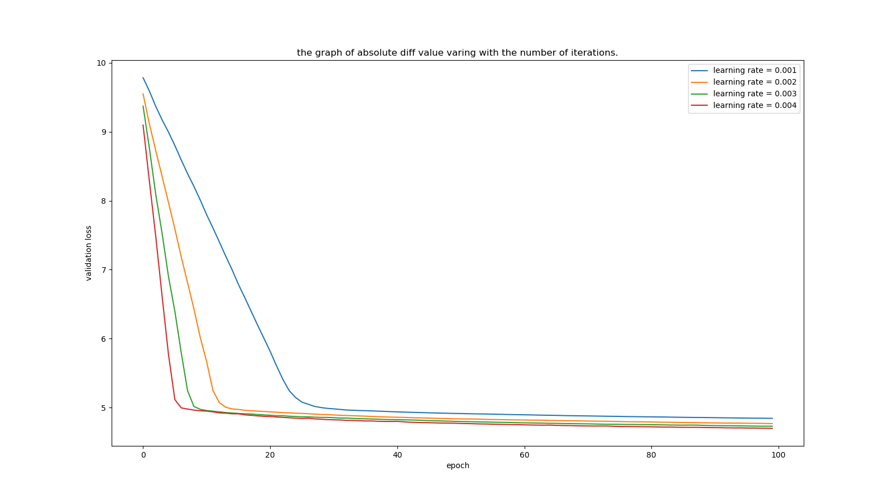

## hyper parameter
```
penalty_factor = 10
learning_rate = numpy.arange(0.001, 0.005, 0.001)
max_epoch = 100
sub_samples = 500
val_sub_samples = 4000
n_features = 123
```
## validation loss

## classification report
```
             precision    recall  f1-score   support

       -1.0       1.00      1.00      1.00      2995
        1.0       1.00      1.00      1.00      1005

avg / total       1.00      1.00      1.00      4000

             precision    recall  f1-score   support

       -1.0       1.00      1.00      1.00      2995
        1.0       1.00      1.00      1.00      1005

avg / total       1.00      1.00      1.00      4000

             precision    recall  f1-score   support

       -1.0       1.00      1.00      1.00      2995
        1.0       1.00      1.00      1.00      1005

avg / total       1.00      1.00      1.00      4000

             precision    recall  f1-score   support

       -1.0       1.00      1.00      1.00      2995
        1.0       1.00      1.00      1.00      1005

avg / total       1.00      1.00      1.00      4000
```